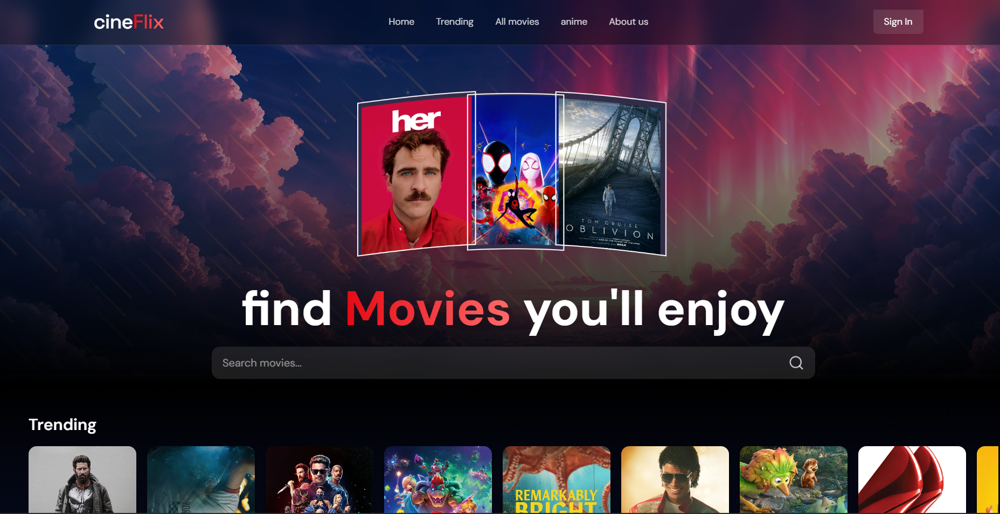
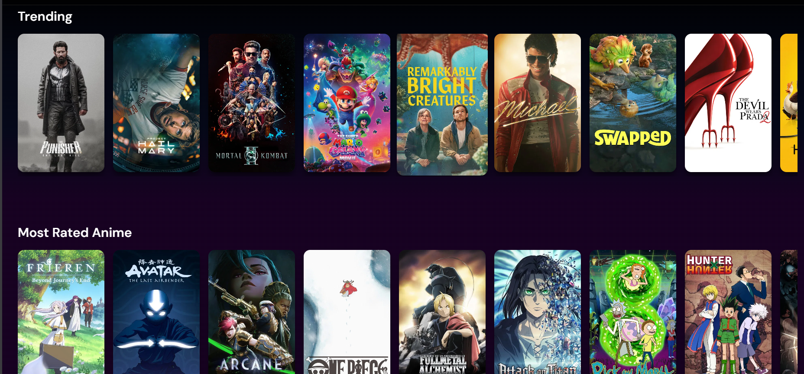
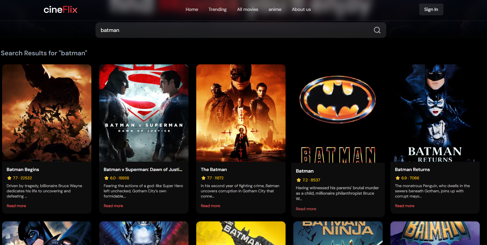

# 🎬 CineFlix


A React-based movie discovery app that uses the TMDB API to browse trending and popular movies and search titles in real time.

---

## Home page and Movie sections

<p align="center">
  
  
</p>

### 🔍 Movie Search

<p align="center">
  
</p>

---

## ✨ Features

- Browse trending movies
- View popular movies
- Search movies by title
- Loading states during API calls
- Error handling for failed requests
- Responsive UI
- API key management using environment variables

---

## 🛠️ Tech Stack

### Frontend
- React.js
- JavaScript (ES6+)
- Tailwind CSS
- Vite

### API
- TMDB API

---

## 📁 Project Structure

```text
cineflix/
├── public/
├── src/
│   ├── components/
│   ├── App.jsx
│   ├── main.jsx
│   └── index.css
├── .env
├── package.json
└── README.md
```

---

## 💡 What I Learned

Through this project, I learned:
- React component structure
- State management using hooks
- Fetching API data
- Conditional rendering
- Handling loading & error states
- Working with environment variables
- Building responsive layouts using Tailwind CSS

---

## 🚀 Future Improvements

- 🎥 Detailed movie pages
- ❤️ Favorites / Watchlist
- 📄 Pagination or infinite scrolling
- 🌙 Dark/Light mode
- 🔐 User authentication
- ⚙️ Backend integration

---

## ⚙️ Setup

### Clone Repository

```bash
git clone https://github.com/notsomohit/cineflix-v1.git
cd cineflix-v1
```

### Install Dependencies

```bash
npm install
```

### Create Environment Variables

Create a `.env` file:

```env
VITE_TMDB_API_KEY=your_tmdb_api_key_here
```

### Run the App

```bash
npm run dev
```

App runs on:

```bash
http://localhost:5173
```

---

## 📄 License

This project is licensed under the MIT License.
